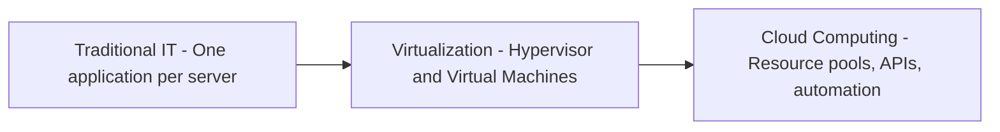
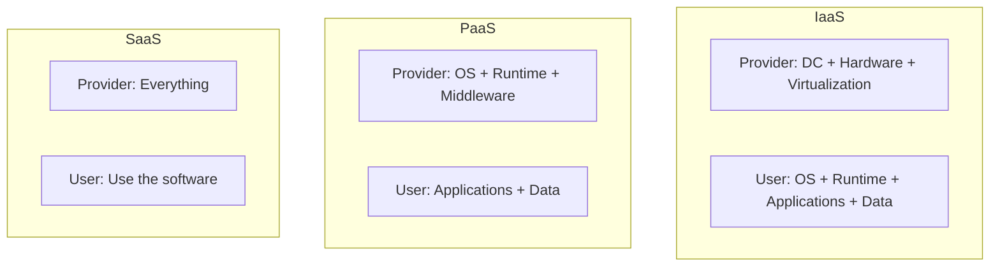
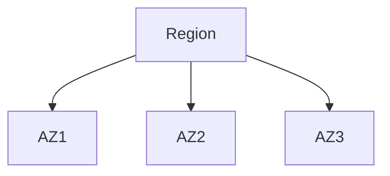

# Chapter 1 – Diving into Huawei Cloud

## 1. ICT Evolution and the Emergence of Cloud Computing
Information and Communication Technology (ICT) has evolved through multiple stages:

- **PC Era:** Standalone computing with limited scalability.
- **Internet & Mobile Era:** Improved connectivity but infrastructure remained hardware-centric.
- **Cloud Era:** Computing resources are delivered as services over the Internet.

As applications became larger, more complex, and more dynamic, traditional IT infrastructure could no longer meet requirements for speed, scalability, and cost efficiency.

## 2. Limitations of Traditional IT Infrastructure
Traditional IT environments rely on fixed physical hardware, which introduces several challenges:

- **Slow deployment:** Hardware procurement, installation, and configuration can take weeks or months.
- **Low resource utilization:** Servers are often dedicated to a single application and remain idle most of the time.
- **High total cost of ownership (TCO):** Costs include hardware, power, cooling, data center space, and IT staff.
- **Poor scalability:** Expanding or shrinking capacity is difficult and time-consuming.
- **Complex operations and maintenance (O&M):** Monitoring, fault detection, and recovery are largely manual and slow.

Slow deployment, high cost, idle resources → Cloud computing

## 3. Evolution of IT Architecture

**Traditional IT:** Applications are tightly coupled with physical servers. Utilization is low and expansion is limited.

**Virtualization:** A hypervisor allows multiple VMs on a single physical server, improving utilization, but provisioning and scaling are still mostly manual.

**Cloud Computing:** Resources are abstracted, pooled, and managed automatically. Users request resources through APIs, and the platform handles provisioning.

Virtualization alone does **not** equal cloud computing.
Cloud = **Virtualization + Automation + Service Delivery Model**.

## 4. Definition of Cloud Computing
Cloud computing is a model that:
- Provides computing resources over the Internet
- Enables **on-demand self-service**
- Uses **APIs** for management
- Supports **elastic scaling**
- Charges based on **actual usage**

## 5. Value of Cloud Computing
- **Cost efficiency:** Converts capital expenditure (CAPEX) into operational expenditure (OPEX) using pay-as-you-go pricing.
- **Elastic scalability:** Resources can be scaled up or down at any time according to demand.
- **Rapid provisioning:** Services can be deployed in minutes instead of weeks or months.
- **Global accessibility:** Cloud services can be accessed from anywhere through the Internet.
- **Automated operations:** Reduces manual O&M and improves system reliability.

## 6. Cloud Service Models

IaaS examples: ECS, EVS, VPC
PaaS example: RDS
SaaS example: Email services

## 7. Cloud Deployment Models
- **Public Cloud:** Shared infrastructure used by multiple tenants.
- **Private Cloud:** Dedicated infrastructure for a single organization.
- **Hybrid Cloud:** Combines public and private environments.

Hybrid cloud is **not** the same as multi-cloud.

## 8. Regions and Availability Zones

**Region** is a geographic boundary.
**Availability Zones** are isolated data centers within a region.

*High availability → deploy across **multiple AZs***

*Disaster recovery → deploy across **multiple regions***

## 9. Huawei Cloud Ecosystem
Huawei Cloud supports enterprises, developers, partners, and open APIs.

## 10. Accessing Huawei Cloud
Users can access Huawei Cloud using:
- Web console
- APIs
- CLI tools
