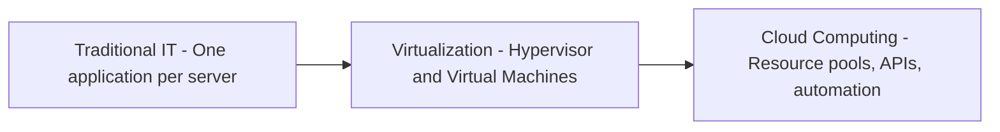
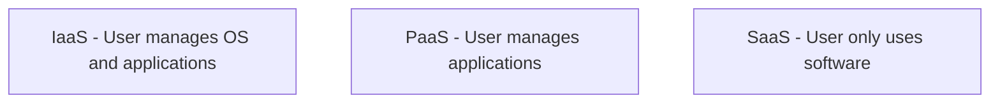
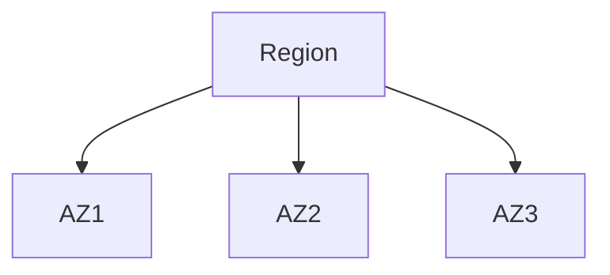

# Chapter 1 – Diving into Huawei Cloud

## 1. ICT Evolution and the Emergence of Cloud Computing
Information and Communication Technology (ICT) has evolved through multiple stages:

- PC Era: Standalone computing with limited scalability.
- Internet & Mobile Era: Improved connectivity but infrastructure remained hardware-centric.
- Cloud Era: Computing resources are delivered as services over the Internet.

As applications became larger, more complex, and more dynamic, traditional IT infrastructure could no longer meet requirements for speed, scalability, and cost efficiency.

## 2. Limitations of Traditional IT Infrastructure
Traditional IT environments rely on fixed physical hardware, which introduces several challenges:

- Slow deployment due to procurement and installation
- Low resource utilization
- High total cost of ownership (TCO)
- Poor scalability
- Complex operations and maintenance (O&M)

Slow deployment, high cost, idle resources → Cloud computing

## 3. Evolution of IT Architecture

Traditional IT tightly couples applications with physical servers.
Virtualization improves utilization but still requires manual management.
Cloud computing introduces automation, elasticity, and service delivery.

Virtualization alone does not equal cloud computing.

## 4. Definition of Cloud Computing
Cloud computing is a model that:
- Provides computing resources over the Internet
- Enables on-demand self-service
- Uses APIs for management
- Supports elastic scaling
- Charges based on actual usage

## 5. Value of Cloud Computing
- Converts CAPEX to OPEX
- Enables elastic scalability
- Provides rapid provisioning
- Allows global access
- Reduces manual operations

## 6. Cloud Service Models

IaaS examples: ECS, EVS, VPC
PaaS example: RDS
SaaS example: Email services

## 7. Cloud Deployment Models
- Public Cloud
- Private Cloud
- Hybrid Cloud

Hybrid cloud is not the same as multi-cloud.

## 8. Regions and Availability Zones

Region is a geographic boundary.
Availability Zones are isolated data centers.

High availability requires multi-AZ deployment.

## 9. Huawei Cloud Ecosystem
Huawei Cloud supports enterprises, developers, partners, and open APIs.

## 10. Accessing Huawei Cloud
Users can access Huawei Cloud using:
- Web console
- APIs
- CLI tools
